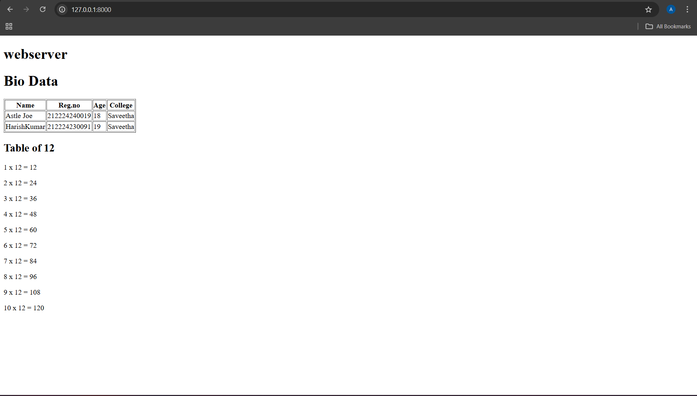

 
# EX01 Developing a Simple Webserver
## Date:

## AIM:
To develop a simple webserver to serve html pages and display the configuration details of laptop.

## DESIGN STEPS:
### Step 1: 
HTML content creation.

### Step 2:
Design of webserver workflow.

### Step 3:
Implementation using Python code.

### Step 4:
Serving the HTML pages.

### Step 5:
Testing the webserver.

## PROGRAM:
````html
<!DOCTYPE html>
<html lang="en">
<head>
    <meta charset="UTF-8">
    <meta name="viewport" content="width=device-width, initial-scale=1.0">
    <title>12 thTable</title>
</head>
<body>
    <h1 style="color: blueviolet;">webserver</h1>
    <h1>Bio Data</h1>
    <table border="1">
        <tr>
            <th>Name</th>
            <th>Reg.no</th>
            <th>Age</th>
            <th>College</th>
        </tr>
        <tr>
            <td>Astle Joe</td>
            <td>212224240019</td>
            <td>18</td>
            <td>Saveetha</td>
        </tr>
        <tr>
            <td>HarishKumar</td>
            <td>212224230091</td>
            <td>19</td>
            <td>Saveetha</td>
        </tr>
    </table>
    <h2>Table of 12</h2>
    <p>1 x 12 = 12</p>
    <p>2 x 12 = 24</p>
    <p>3 x 12 = 36</p>
    <p>4 x 12 = 48</p>
    <p>5 x 12 = 60</p>
    <p>6 x 12 = 72</p>
    <p>7 x 12 = 84</p>
    <p>8 x 12 = 96</p>
    <p>9 x 12 = 108</p>
    <P>10 x 12 = 120</P>

</body>
</html>
````

## OUTPUT:


## RESULT:
The program for implementing simple webserver is executed successfully.
